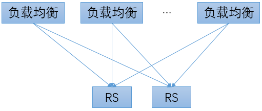

# 健康检查机制

## 健康检查的原理

在负载均衡系统内，会维护一个RS的状态表，用于保存每个RS的健康状态。在转发流量时，只会将流量转发给健康状态为“正常”的RS。

为了获得RS的健康状态，负载均衡系统会定期向RS发送探测请求，并根据收到响应的情况来修改对应RS的健康状态。

## 主动健康检查 vs 被动健康检查

“**主动健康检查**”的机制可以简要描述如下：

+ 负载均衡系统**持续**向RS发送探测请求
+ 在RS为“正常”的状态下，如果连续探测失败的次数到达一定的阈值，则改变RS的健康状态为“失败”
+ 在RS为“失败”的状态下，如果连续探测成功的次数到达一定的阈值，则改变RS的健康状态为“正常”

主动健康检查中RS的状态变化可以用一个简单的有限状态机来描述。

对于健康检查来说，一个重要的指标是“响应时间”，即：当RS的状态发生改变后，经过多长时间负载均衡系统才能感知到变化。如果不能及时感知到RS的失败，可能会导致请求发送到失败的RS节点上，从而导致服务的失败；如果不能及时感知到RS的恢复，可能会使其它正常的RS节点压力过大。

对于主动健康检查来说，降低响应时间的方法是提高发送探测请求的频率。但这个方案也是有代价的。一方面，它会增大负载均衡系统发送探测请求的压力；另外一方面，也会增大RS的压力。第二个问题在软件负载均衡场景中变得更为突出。

在前面章节“[网络前端技术的发展趋势](../../frontend_principle/trend/trend.md)”中提到，“软件化”是网络前端接入系统的重要趋势。软件负载均衡的一个重要特征是支持负载均衡节点的大规模横向扩展部署。在传统硬件负载均衡场景，最常见是“主+备”的部署模式，RS的上游一般是2个负载均衡节点。而在软件负载均衡场景下，一个负载均衡集群可能由几十个节点构成。尤其是对于七层负载均衡场景，单个负载均衡节点的容量较小，单个集群可达到数百个节点。在这种情况下，如果继续使用“主动健康检查”的机制，持续的健康检查探测请求会对下游的RS产生很大的压力。

为了解决上面的问题，可以使用"**被动健康检查**"的机制，简要描述如下：

+ 在RS为“正常”的状态下，负载均衡系统不会主动向RS发送探测请求
+ 在RS为“正常”的状态下，如果RS**处理业务请求**连续失败的次数超过一定阈值，则改变RS的健康状态为“失败”
+ 在RS为“失败”的状态下，负载均衡系统向RS发送探测请求
+ 在RS为“失败”的状态下，如果连续探测成功的次数到达一定的阈值，则改变RS的健康状态为“正常”

被动健康检查中RS的状态变化及主动探测的启停可以用一个下面的有限状态机来描述。

被动健康检查的一个显著的差异是：使用正常的业务请求来“捎带”的进行探测。

## 集中式健康检查 vs 分布式健康检查

## BFE的健康检查