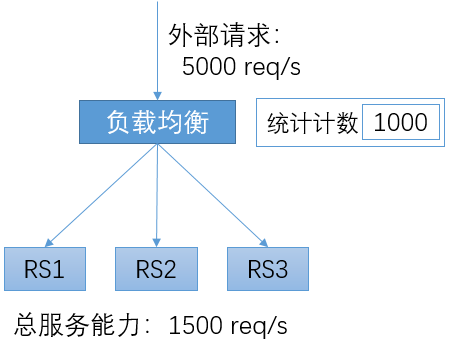
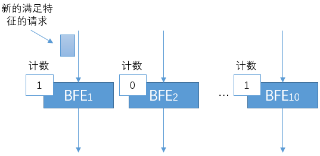
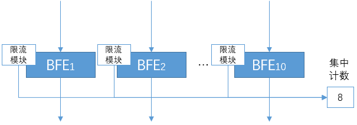
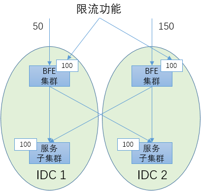

# 限流机制

## 概念

限流的场景如上图所示。由3个RS构成一个服务，总的服务能力为每秒1500个请求。而在某个时刻，外部请求的速率为每秒5000个请求。如果负载均衡直接将所有外部请求都转发给RS，RS将发生过载，从而导致对所有请求的处理都延迟增大，并导致部分请求被拒绝；严重的情况下，过载的流量可以将服务程序压垮，或发生其它不可预期的结果。在客户端程序中往往包含超时机制，延迟过大的响应从客户端看来常常被判定为失败，从而导致所有用户都感知到服务的失败。

互联网是一个非常开放的架构，无法对客户端的行为进行限制。在正常的场景下，外部请求超过后端服务能力也是经常发生的。如：某些新闻事件导致新闻网站或搜索网站的访问量突增。另外，还会出现由于恶意攻击而导致的服务过载。

负载均衡系统往往会提供限流机制，以对下游的服务进行保护。在负载均衡系统中，可以针对下游服务设置服务阈值；在外部请求超过服务阈值后，负载均衡将停止向RS的转发，而直接向客户端返回响应、或者直接拒绝请求。这样，对于在超过服务阈值前转发的请求仍然是可以正常处理的。

限流有时也被称为“熔断”，“熔断”这个词对于描述这个机制是非常形象的。

## 限流的配置

对于限流来说，典型的配置如上图所示，包括：

+ 统计特征

  可能会将域名、URL或其它更多HTTP请求中的信息作为统计的特征。

+ 统计周期

  虽然可以设置为其它值，但是一般都将统计周期设置为1秒。如果设置为更长的周期，可能会出现所有阈值范围内的请求都在最开始的1秒内到达，从而将服务压垮；如果设置的更短，考虑到系统中的各种延迟，会给实现带来很高的难度。

+ 阈值

  可以根据服务的容量设置限流的阈值。服务的容量可能是静态的（如：通过离线的压测得到），也可能是动态的（如：实时通过CPU等资源的情况推测）。

+ 动作

  在统计周期内，如果请求的数量超过阈值，则会触发预先设置的动作。可能的动作包括关闭连接、展示指定网页等。

## 分布式限流

在限流的实现中，需要在负载均衡转发实例上对请求计数。当计数超过预定的阈值时，则执行预定的动作。

在使用软件负载均衡的场景，转发往往是由多个转发实例构成的负载均衡集群来完成的。针对限流这个功能，是否可以简单的将阈值在多个负载均衡转发实例间平均分配呢？例如，在下图中，在单机上限流的阈值为10。如果转发由10个BFE实例来完成，在每个转发实例上都配置限流阈值为1，是否可以达到总体限流阈值为10的效果呢？

在实践中，发现最终通过的流量经常比设定的总体阈值要更小。发生这种情况的原因是：

+ BFE上游使用四层负载均衡来分配流量

+ 四层负载均衡可以实现：对于一个Virtual Server，将新建连接按照Round Robin模式均分到多个BFE实例上

  

+ 需要注意的是：以上的均分是**针对单个Virtual Server的所有请求**，而不是**针对限流统计特征的所有请求**。

+ 对于满足限流特征的请求，在多个BFE实例间的分配是不均衡的。会出现下图所示的场景：某些BFE实例的计数仍然为0，而某些BFE实例的计数已经达到阈值从而开始拒绝流量。

为了解决上面提到的问题，需要在一个BFE集群内采用集中计数的方式。当有新的请求到达某个BFE实例时，BFE的限流模块会上报给集中计数的系统（可以使用redis来实现）。如果集中的计数超过预定的阈值，则执行预定的动作。

## 入口限流 vs 目的限流

将限流机制用于多数据中心场景，会遇到一些新的问题，下面做一个简要的分析。

如下图所示，有2个数据中心，其中各部署了一个BFE集群用于七层负载均衡。有2个服务子集群，分别位于2个数据中心。在2个BFE集群上都开启限流功能。假设每个服务子集群的服务能力为100 req/s。那么为了保护服务子集群不过载，将每个BFE集群的限流阈值设为100是否可以呢？

其实这样是不行的。不能简单的假设到达2个BFE集群的流量是相等的。如“[内网流量调度机制](../gslb/gslb.md)”中所述，外网流量会随着多种原因而发生变化，多个网络入口之间的流量关系是很不确定的。下面描述了这样一种可能：到达IDC1入口的流量为50 req/s，到达IDC2入口的流量为150 req/s。虽然从总体上看总的流量并没有超出总的服务能力，但是由于限流的配置，在IDC2的BFE集群会将超过100的流量丢弃。

发生这种问题的根本原因是：在限流的**目的**（保护服务子集群）和限流的**手段**（在网络入口处限流）之间出现了不一致。要从根本上解决这个问题，需要将“入口限流”改变为“目的限流”。具体方案如下图所示，需要使用2层的七层负载均衡集群：上面那层BFE集群用于跨机房调度，下面那层BFE集群用于执行限流。这个方案的代价较大，需要增加一层负载均衡的资源消耗，可以在对限流准确性有较高要求的场景使用。

## 限流 vs 内网流量调度

从表面上看，限流和“[内网流量调度](../gslb/gslb.md)”似乎有一些相似之处。内网流量调度提供了“黑洞”能力，可以主动丢弃一定比例的流量，也能起到过载保护的效果。

在过载保护的能力方面，限流和内网流量调度存在以下差异：

+ 生效速度

  在流量超过阈值的情况下，限流可以在秒级内产生效果；而内网流量调度需要几十秒才能做出调整，对于秒级的突发流量无能为力

+ 生效粒度

  基于计数器，限流可以精确到单个请求的粒度；内网流量调度的生效基于BFE处设置的权重，控制粒度较粗

  