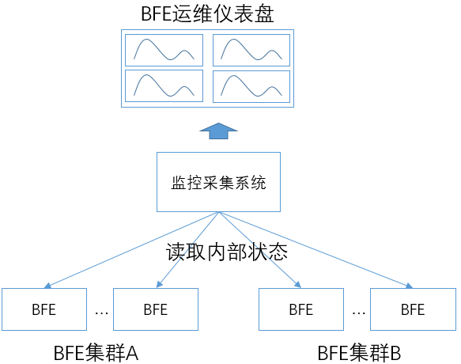

# 监控机制

BFE作为一个七层负载均衡软件，需要7*24小时的持续稳定运转。为了保证系统的稳定性和正确性，对于系统的监控非常重要。下面对BFE的监控机制做一个简要的介绍。

## 日志监控及其问题

很多系统依赖于对外输出的错误日志来发现系统的问题，具体方法是：

+ 在错误发生时，打印日志，其中包含错误的信息
+ 配置监控系统，对于日志的内容进行监控，如果发现有错误的信息，则输出报警

在很多时候，不仅希望看到系统错误的情况，也希望能够看到系统的一些状态。比如：目前并发的连接数有多少，每秒处理请求的数量有多少，等等。类似这样的需求，在很多系统中也是依靠分析系统输出的日志来实现的。

基于系统日志来监控的机制，存在以下问题：

+ 被监控系统的资源消耗较高

  打印日志会使用磁盘IO，是一个消耗资源很高的操作。如果是输出文本日志，日志格式化时所进行的字符串操作也是消耗CPU资源较多的。

  大家可以做这样的试验：对于BFE或者Nginx，打开或关闭访问日志的输出，会看到明显的性能变化。

+ 监控系统的资源消耗较高

  对日志进行监控，监控系统要进行读取、解析、匹配等操作，都是资源消耗较多的。

  曾经听说过这样的案例：业务系统运行时使用了4核CPU；为了分析这个系统输出的日志，监控系统也使用了4核CPU。监控使用了和业务系统几乎一样多的资源，成本有些太高了。

+ 很多状态信息并不适合都打印输出

  如果希望了解BFE内部系统间的调用处理情况，不可能将这些内部调用的情况都通过打印日志的方式输出。

## BFE的内部状态输出

为了更方便的向外展示内部的状态信息，BFE做了一些专门的设计：

+ 在BFE的主逻辑和BFE的各扩展模块中，使用专门的存储来维护状态信息
+ 在BFE程序中嵌入一个Web Server，用于外部读取BFE内部的状态信息及触发配置加载

下面是一个在浏览器中查看从BFE监控端口读取结果的例子。状态信息默认以JSON格式输出，每项包括状态变量名及变量的值。比如：CLIENT_REQ_ACTIVE是指当前活跃的请求数，CLIENT_REQ_SERVED是指从BFE程序启动以来，一共服务的请求数。

这个设计的好处是：

+ 状态信息可以低成本的收集和汇聚

  一个状态的累加计算，成本仅仅是对BFE内存中一个变量的“加1”操作。

+ 状态信息可以低成本的读取

  监控系统通过BFE对外的监控端口，一次可以读取几十甚至几百个变量。由于BFE所输出的状态信息为格式化数据，也便于监控系统对内容进行解析。

通过以上方式，BFE向外暴露数千个内部状态信息，可以反映出系统内部各方面的实时状态。使用监控系统（如Prometheus）对各BFE程序实例的状态信息做采集和汇聚，可以形成BFE集群的运维仪表盘。

