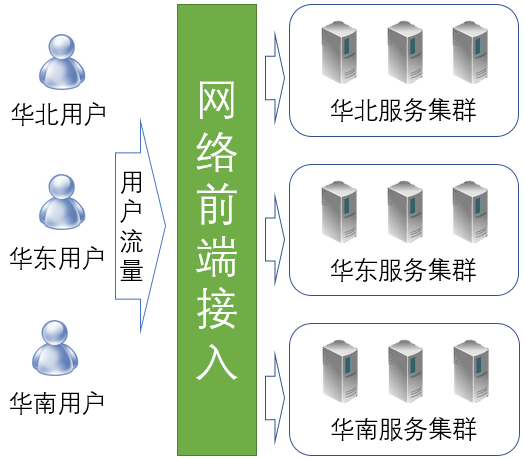

# 网络前端接入技术简介

## 什么是网络前端接入

FE（Front End）这个词经常会用在区分软件工程师的角色：在浏览器上基于javacript、html等技术开发前端程序的工程师，常被称为“前端工程师”，或“FE工程师”；而在服务器上基于C++、Java、Go等编程语言开发后台程序的工程师，被称为“后端工程师”。

网络前端接入的英文也是Front End，缩写为FE。从事网络前端接入方向的工程师不是“前端工程师”，而是“网络研发工程师”。在这里，“前端”（Frond End）是从网络和用户访问的角度出发而产生的概念。"后端"(Back End)的服务位于数据中心中，是用户无法直接访问的；用户的流量必须要经过网络前端接入（也就是"前端"）的转发才能到达后端。我们也可以把网络前端接入定义为“流量从用户到达服务的过程”。

流量从用户到达数据中心内的服务并不是一个很简单的过程。流量从用户到达服务，要经过很多系统或设备的处理，其中包括家庭或公司的网络，也包括运营商的网络，还有服务提供商自己的网络。网络前端接入非常关键，如果这个环节出了问题，即使数据中心内的服务是正常的，用户仍然无法很好的访问服务。

## 网络前端接入面临的挑战

## 百度的网络前端接入方案

## 谷歌的网络前端接入