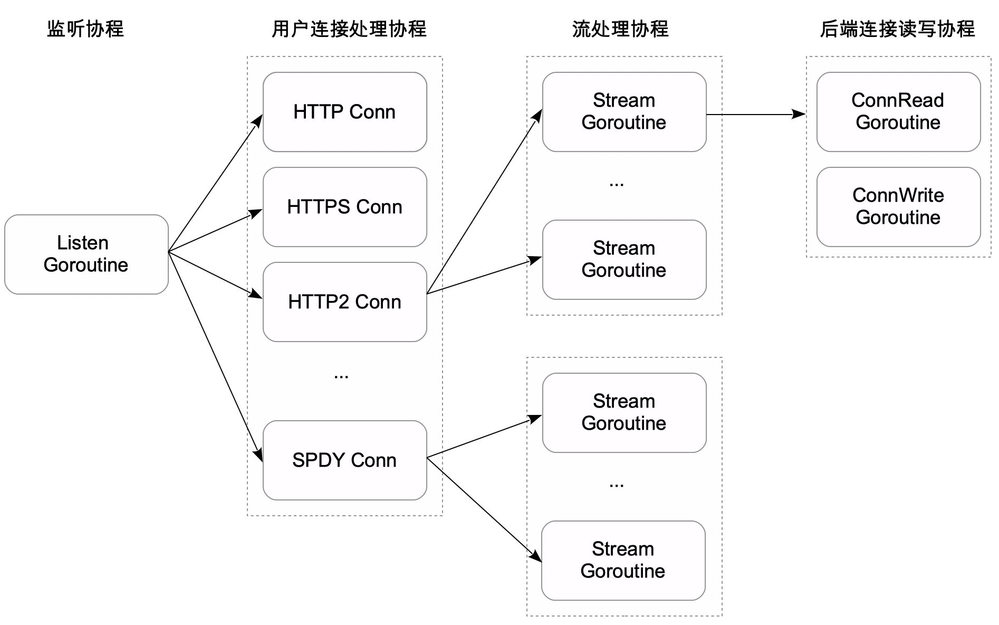

#  进程模型

BFE系统的转发实例由一组协同工作的进程组成（详见[BFE简介](../../background/what-is-bfe.md)章节）。这里以其中最核心的转发进程为重点介绍。

BFE的转发进程是由Go语言编写、基于Go协程实现的高并发网络服务器。BFE的转发进程中包含了几类重要的协程:

- **网络相关协程**
   - 用户连接的监听协程、用户连接的处理协程，以及协议相关的请求处理协程。
   - 后端连接的建立协程、后端连接的读写协程

- **管理相关协程**
   - 针对后端健康状态的检查协程
   - 监控及热加载请求的处理协程

- **辅助相关协程**
   - 扩展模块也可以创建协程，用于后台定期操作或异步执行处理
   - 例如：定期进行日志切割、异步更新缓存等

## 并发模型

BFE转发实例可以启动一个或多个监听协程。如果用户访问大量是短连接，单个监听协程仅使用的单个CPU核并可能成为瓶颈。这时可以通过适当调节监听协程数量来提升吞吐。

每个新到的用户连接将在独立的用户连接处理协程中并发处理。对于HTTP/HTTPS协议，用户连接处理协程串行读取请求并处理；对于HTTP2/SPDY协议，由于协议支持多路复用，在多个独立的流处理协程中并发处理请求。

在向后端实例转发请求并读取响应时，涉及到一组后端连接读写协程，分别负责将请求数据写往后端连接、从后端连接读取响应数据。





## 并发能力

BFE协程可以充分利用单机的多核CPU提升并发量及吞吐。但基于Go语言协程的并发模型也存在局限：

- 并发能力与CPU核数并非持续呈线性增长

  当单机核数非常大时，由于锁竞争继续增加核数可能并不能提升极限性能。在实践中，一般通过针对流量接入场景制定最佳机型套餐或容器规格，通过多实例来提供服务，从而达到线性提升整体性能的效果。 

- 难以绑定到固定的CPU核以利用CPU亲缘性提升极限性能


## 异常恢复

由于转发程序的复杂性及快速迭代特点，潜在PANIC问题难以通过线下测试完全被发现。但在一些情况下触发PANIC后，会对转发集群稳定性带来非常严重的影响，例如由特定类型请求（Query of Death）触发。

因此，BFE所有网络相关协程都利用了Go语言内置的PANIC恢复机制，避免在连接/请求处理过程中由于未知Bug导致BFE转发实例大规模PANIC退出。

```go
// bfe_server/http_conn.go:serve()

defer func() {
    if err := recover(); err != nil {
        log.Logger.Warn("panic: conn.serve(): %v, readTotal=%d,writeTotal=%d,reqNum=%d,%v\n%s",
        c.remoteAddr, c.session.ReadTotal, c.session.WriteTotal, c.session.ReqNum,
        err, gotrack.CurrentStackTrace(0))
        ...
    }
    ...
}()
```

在出现PANIC后，往往仅影响单个连接或请求。同时PANIC恢复阶段输出的上下文日志，也便于可高效分析定位出问题根因。对于一些难以在线下复现的问题，基于PANIC修复的经验，往往通过代码分析就能找到答案。

