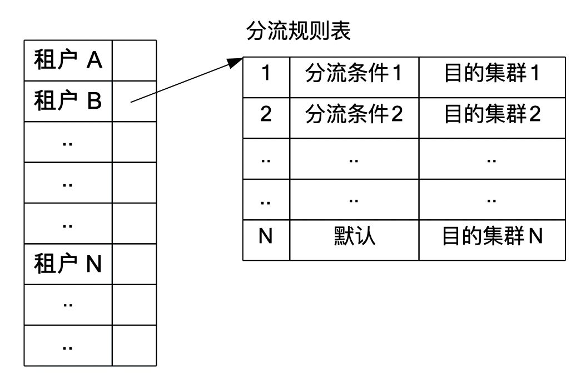

# 流量路由

BFE接入了多个租户的流量，每个租户包含多个集群，分别处理不同类型业务的请求。流量路由指BFE在转发请求过程中，确定请求所属的租户及处理该请求的目标集群的过程。

## 关键数据结构

在bfe_route/host_table.go 中定义了用于管理路由规则的数据结构。主要包含以下重要类型：

1. 域名表(hostTable): 管理了域名与租户标识的映射关系。
hostTable 是一个Trie树类型的数据结构，以便于支持泛域名查找。简单来说，该Trie树从根节点到叶子节点的路径，代表了域名（逆序形式）, 叶子节点存有租户名称。

2. VIP表(vipTable): 管理了VIP与租户标识的映射关系。
vipTalbe 是一个哈希表类型的数据结构。其中的键代表VIP，值代表租户名称。

3. 分流规则表(productRouteTable): 管理了各租户的分流规则表。
productRouteTalbe 是一个哈希表类型的数据结构。其中的键代表租户名称, 值代表分流规则表。
分流规则表包含了一组有序的分流规则。每条规则由规则条件及目的集群组成

4. 规则条件(Condition): 规则条件是一个包含了条件原语及操作符的表达式。其数据结构是一个中缀表达式形式的二叉树。
二叉树的根节点及非叶子节点代表了操作符。叶子节点代表条件原语。
对请求执行与规则条件匹配时，相当于对该中缀表达式进行求值。返回值是布尔类型，代表请求是否匹配规则。

## 目的租户路由

HostTable的LookupHostTagAndProduct()实现了目的租户的查找。

查找的基本流程如下：

- 步骤一: 根据请求的Host字段值，尝试查找hostTable并返回命中的租户名称。

- 步骤二: 如果查找失败，根据请求的访问VIP值，尝试查找vipTable并返回命中的租户名称。

- 步骤三: 如果查找失败，返回缺省的租户名称。

## 目的集群路由

HostTable的LookupCluster()实现了目前集群的查找。

查找的基本流程如下：

- 步骤一：根据请求的归属租户名称查找分流规则表。

- 步骤二：在上一步的分流规则表中，按顺序将请求与表中各规则的条件进行匹配。并返回最先匹配到的规则中，所包含的目前集群。

注意分流规则表的最后一条规则是缺省规则，如果执行到最后一条规则，将最终返回缺省的目的集群。

